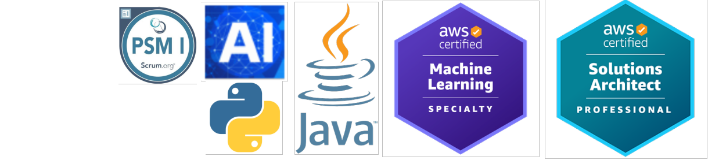

## Hi there 👋

## I am Ravindra Pandya!
## Lead Software Engineer | Generative AI | Cloud | 3x AWS | Python | Java | ex J.P. Morgan | Technology Trainer
## AWS Certified Machine Learning Specialty, Solution Architect

 <!-- https://drive.google.com/file/d/1WWCejyr7q9vGDI6wO8_74-01WeARrw2m/view -->

<!--
**ravindraptech/ravindraptech** is a ✨ _special_ ✨ repository because its `README.md` (this file) appears on your GitHub profile.

Here are some ideas to get you started:

- 🔭 I’m currently working on ...
- 🌱 I’m currently learning ...
- 👯 I’m looking to collaborate on ...
- 🤔 I’m looking for help with ...
- 💬 Ask me about ...
- 📫 How to reach me: ...
- 😄 Pronouns: ...
- ⚡ Fun fact: ...
-->
