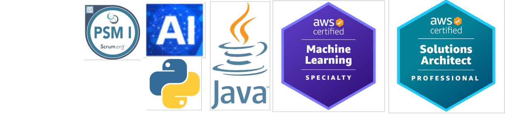

## Hi there! 👋   I am Ravindra Pandya.    
#

- Lead Software Engineer | Solutions Architect | Technology Consulting
- Generative AI | Cloud | 6x AWS | Python | Java
- AWS Certified Machine Learning Specialty, Security Sepcialty
- AWS Certified Solutions Architect

# 
### 📋 My Projects

| Project Name                           | Demo         | Repository Link                                                                    | Libraries                              |
| -------------------------------------- | -------------- | ---------------------------------------------------------------------------------- | -------------------------------------- |
| **Customer Service Assistant - ChatBot using ChatGPT API**  | [App - ChatBot](https://ravindrap-ai-chatbot.streamlit.app/) | [ChatBot](https://github.com/ravindraptech/ai-chatbot) | `Genrative AI • RAG • Python • Streamlit • ChromaDB` |
| **AI based Investment Advisor**        | [App - Inv. Adv.](#) | [AI Based Investment Advisor](https://github.com/ravindraptech/ai-investment-advisor) | `Genrative AI • Python • Streamlit • ChromaDB` |
| **Creating a Content-Based Recommendation System (NLP)**  | [App - Rec. Sys.](#) | [Recommendation System - NLP](https://github.com/ravindraptech/ai-nlp-recommendation-system) | `NLP • Python • Streamlit` |
| **Document QnA**  | [App - Doc QnA](https://ravindrap-document-app.streamlit.app/) | [Document QnA](https://github.com/ravindraptech/document-qa) | `Generative AI • Python • OpenAI • Streamlit` |
# 
-  Connect on email: 📫 **kampvt07@gmail.com**
# 

<!--
**ravindraptech/ravindraptech** is a ✨ _special_ ✨ repository because its `README.md` (this file) appears on your GitHub profile.

Here are some ideas to get you started:

- 🔭 I’m currently working on ...
- 🌱 I’m currently learning ...
- 👯 I’m looking to collaborate on ...
- 🤔 I’m looking for help with ...
- 💬 Ask me about ...
- 📫 How to reach me: ...
- 😄 Pronouns: ...
- ⚡ Fun fact: ...
-->
